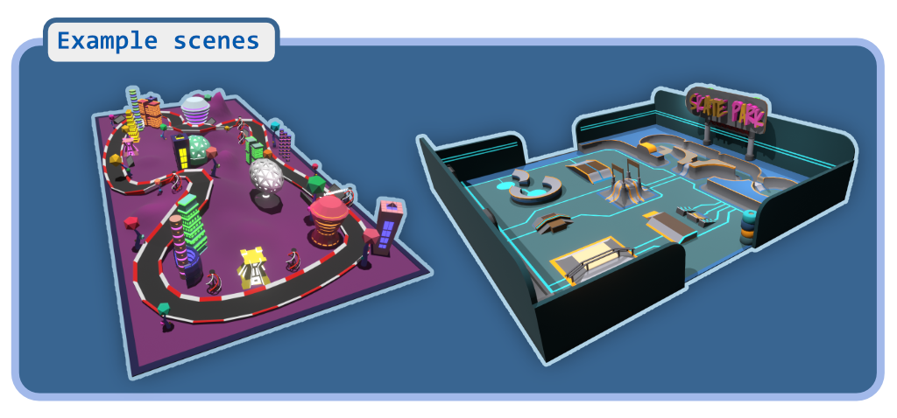

# Infinity Engine SDK7 Template


This scene is an example of using the Infinity Engine with Decentraland SDK7.

It includes a pair of working example scenes, as well as the blend files used to create them. There are also full instructions for importing your own scenes.

You can see a demo of the scene at [ToDo - add link].




# Getting Started

### Documentation: [View the Wiki](../../wiki/)


See the [Wiki: Quick Intro](../../wiki/Quick-intro) for a brief guide of how to get up and running.

There are also guides to the **asset pipeline**, **components and systems**, and **debugging tools**.


## Try it out

**Previewing the scene**

1. Download this repository.

2. Install the [Decentraland Editor](https://docs.decentraland.org/creator/development-guide/sdk7/editor/)

3. Open the repository folder in Visual Studio Code.

4. Open the Decentraland Editor tab, and press **Run Scene**

Alternatively, you can use the command line. Inside this scene root directory run:

```
npm install
npm run start
```


Repository folder structure
--

| Folder 	                        | Desc
| ---		                          | ---
| `src/modules/avatar`            | Handles avatar swap logic
| `src/modules/avatarTrap`        | Handles avatar trap. When Infinity Engine is active we must hold the player in center of scene and move the world around the player
| `src/modules/cannon-colliders`  | Utilites for processing colliders from <https://github.com/stom66/blender-dcltk-cannon-colliders>
| `src/modules/scene-slicer`      | Utilities for processing tilesets from  <https://github.com/stom66/blender-dcltk-scene-slicer>
| `src/modules/skybox`            | Generates skyboxes
| `src/modules/spacePartition`    | Utility to generate spacial partitioning
| `src/terrain`                   | Utils around terrain generation spacial grid + colliders
| `src/ui`                        | 2D UI setup here
| `src/world`                     | Much of the Infinity Engine logic


