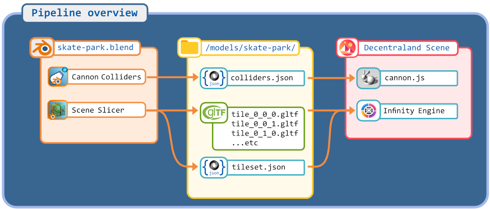

# Infinity Engine SDK7 Template


This scene is an example of using the Infinity Engine with Decentraland SDK7.

It includes a pair of working example scenes, as well as the blend files used to create them. There are also full instructions for importing your own scenes.

You can see a demo of the scene at [ToDo - add link].


Contents:
--

* [Try it out](#try-it-out)
* [Overview](#overview)
	* [Tools used](#tools-used)
	* [Terminology](#terminology)
	* [Folder structure](#folder-structure)
	* [Pipeline overview](#pipeline-overview)
* [Getting Started]()
	* [Demo Files](#demo-files)
	* [Scene configuration](#scene-configuration)
	* [Making a scene from scratch](docs/getting-started.md)
	* [Debugging](#debugging)
	* [Components](#components)
	* [Systems](#systems)


## Try it out

**Previewing the scene**

1. Download this repository.

2. Install the [Decentraland Editor](https://docs.decentraland.org/creator/development-guide/sdk7/editor/)

3. Open the repository folder in Visual Studio Code.

4. Open the Decentraland Editor tab, and press **Run Scene**

Alternatively, you can use the command line. Inside this scene root directory run:

```
npm install
npm run start
```

---

# Overview

Tools Used
--

| Tool                    | Desc
| ---                     | ---
| Blender                 | Used to create models and run plugins described below <https://www.blender.org>
| CannonJS                | Physic engine.  See docs here for more details <https://github.com/schteppe/cannon.js>
| DCL Cannon Collider     | Blender Plugin. Reads meshes and generates cannon colliders with some physics. See docs here more more details: <https://github.com/stom66/blender-dcltk-cannon-colliders>
| DCL Scene Slicer        | Blender Plugin. Slices a large scene into tiles to be rendered by Infinity Engine. See docs here for more details: <https://github.com/stom66/blender-dcltk-scene-slicer>
| Skybox Image Generator  | Generates 360 degree skyboxes

Terminology
--

| Term                      | Desc
| ---                       | ---
| AvatarSwap                | Hide the default DCL avatar and replace with a custom model.
| CannonJS                  | Physics engine used: <https://github.com/schteppe/cannon.js>
| Infinity Engine - Code    | Collecting of Code that makes the Infinity Engine possible.
| Infinity Engine - Concept | DCL scenes have fixed boundaries, putting limits on how big a scene can be. Avatar controls today are somewhat limited. The Infinity Engine adds flexibility to the basic DCL scene boundaries and Avatar controls for a more immersive scene experience.
| SkyBox                    | Hide the default DCL skybox and surround scene with a custom one
| Spacial Partition         | To optimize managing a large number of objects we break them down into smaller chunks. Read more about the concept here: <https://gameprogrammingpatterns.com/spatial-partition.html>


Folder Structure
--

| Folder 	                        | Desc
| ---		                          | ---
| `src/modules/avatar`            | Handles avatar swap logic
| `src/modules/avatarTrap`        | Handles avatar trap. When Infinity Engine is active we must hold the player in center of scene and move the world around the player
| `src/modules/cannon-colliders`  | Utilites for processing colliders from <https://github.com/stom66/blender-dcltk-cannon-colliders>
| `src/modules/scene-slicer`      | Utilities for processing tilesets from  <https://github.com/stom66/blender-dcltk-scene-slicer>
| `src/modules/skybox`            | Generates skyboxes
| `src/modules/spacePartition`    | Utility to generate spacial partitioning
| `src/terrain`                   | Utils around terrain generation spacial grid + colliders
| `src/ui`                        | 2D UI setup here
| `src/world`                     | Much of the Infinity Engine logic


Pipeline Overview
--




# Getting Started


## Demo files

Anything under a folder named 'demo' is reasonably self contained is safe to delete assuming you remove all references to it.   These are for the demo only.  Deleteing these folders will not impact the functionality of the Ininity Engine.  If your `src/myFirstScene/getting-started.ts` or any other file references things in here models will stop showing up or code may complain about a now missing file.  Update references where needed.

Files in here are specific for the demo of Race Track and Skate Park. 

```
src/demo/*
src/scenes/demo/*
assets/demo/*
```


## Creating a Scene from Scratch

See here for a in-depth guide to importing your own scene: [Creating a Scene from Scratch](docs/getting-started.md).

## Scene Configuration

For a full example of a config file see [Infinity Engine Configuration](docs/infinity-engine-config.md).
See [src/sceneConfigType.ts](src/sceneConfigType.ts) for configuration types.

Some of the most common config options are covered below:

* **Parcel size:** defines the size of the scene. Set these to match the `tile_dimensions` declared in `scene.json`

	```ts
	//src/config.ts - line #16
	const ParcelCountX = 5
	const ParcelCountZ = 5
	```

* **Infinity Engine defaults**: default properties used by the engine. These can be over-ridden on a per-scene basis.

	```ts
	//src/config.ts
	AVATAR_TRAP_DEFAULTS   // #72 - defaults for how avatar trap is configured
	AVATAR_DEFAULTS        // #81 - defaults for how avatar swap is rendered
	SKYBOX_DEFAULTS        // #116 - defaults for how skybox is generated
	WORLD_VEHICLE_DEFAULTS // #124 - defaults for how world vehicle is configured
	GRID_DEBUG_DEFAULTS    // #148 - the defaults when grid debug is enabled
	```

* **Scene Admins:** define a list of users authorised to see the various debug/control UI elements.

	```ts
	//src/config.ts, line #24
	ADMINS = [
	  "any", // if set to any will allow anyone to see
	];
	```

## Debugging

See here: [Debugging](docs/debugging.md)

## Components

`MovesWithWorld` can be found in `src/world/worldMoveComponent.ts`. Add this component to any entity you wish to be moved by the Infinity Engine.

```ts
engine.defineComponent('moves-with-world-id', {
	// id of entity
	id: Schemas.String, 

	// position in world, 0,0,0 as origin relative to Infinity Engine scene origin, not scene 0,0,0
    position: Schemas.Vector3
})

```

## Systems


| System 	                        	| Desc
| ---		                        	| ---
| `src/world/movesWithWorldSystem`  	| System that moves the world around the player.  The player is held in place via the Avatar Trap.
| `src/world/worldSpacePartitionSystem` | System determines nearby entities to be loaded and remove far away entities.
| `src/world/worldPlayerControlSystem` | System that controls player movement


## For Better Results

* Keep the number of tracked `MovesWithWorld` components to a minimum. Parent objects as a much as you can, and assign **just** the parent to `MovesWithWorld`. 

### Grid size

When exporting out of DCL Scene Slicer try to keep the verticle part of the tiles bigger.  This reduces the number of cubes the spacial partition system has to keep track of and helps performance.  For example if your entire scene is x:100m, y:20m, z:100m.  If you decide you want 8 meter tiles.  Slice the cubes to be 8x20x8.  To avoid creating extra verticle tiles.  If you are making a very very tall scene x:100m, y:100m, z:100m consider making the slices to be 8x20x8 to reduce the verticle cubes.

The suggestions here mirror closesly the same as the slicers recomendations. [https://github.com/stom66/blender-dcltk-scene-slicer](https://github.com/stom66/blender-dcltk-scene-slicer)

* Suggest using 1/4 parcel size or smaller for good results
* Grid size must be less than 1/2 your total parcel size
* Smaller grid sizes increase the number of checks per frame and reduces performance
* Larger grid sizes will result in the tiles being unloaded closer to the player
* Consider having a larger vertical axis

## Things to keep in mind


* If you assign a `Transform.scale` to a parent entity using `MovesWithWorld` it will affect the positions of the children.

* Will not work with any library that manipulates the `Transfrom.position` component, unless those libraries account for accepting an alternative component, `MovesWithWorld.position`. For example: SDK7 Utils, NPC Toolkit, etc.
	* I do have ideas as to how these libraries could support alternate components.

* `MovesWithWorld` not work with Tween, as Tween manipulates the `Transfrom.position` component, but the Infinity Engine uses Transform to perform its work too.
