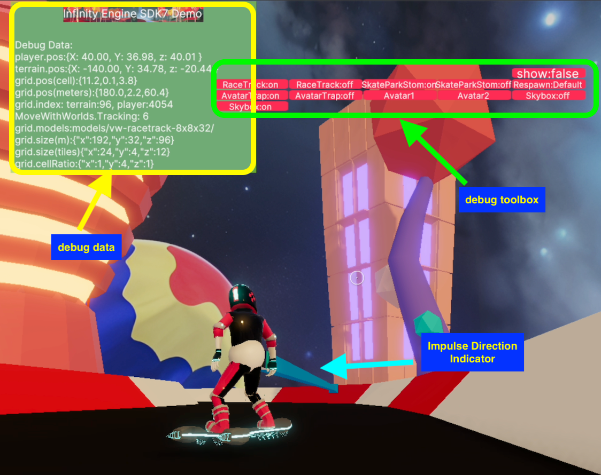
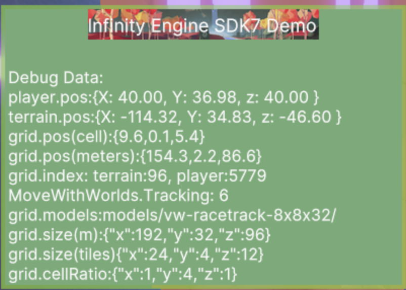
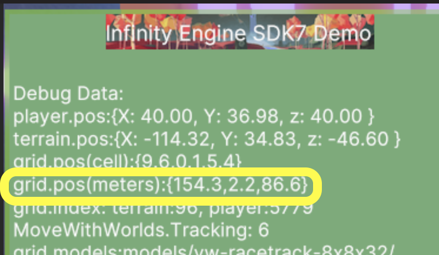

# Debugging
--


#### Debug UI

How do I turn on or off the debug UI?



```ts
//src/config.ts
TEST_CONTROLS_ENABLE = true // #28 - shows debug buttons
SHOW_GAME_DEBUG_INFO = true // #32 - shows player position UI + direction / impulse arrow
```

# Debug UI




| Term                      | Desc
| ---                       | ---
| player.pos                | position of the actual DCL player as they are held via the avatar trap
| terrain.pos               | position of the terrain relative to the actual scene (not the infinity engine scene/world as it is moved around the player
| grid.pos(cell) | What cell index the spatial grid 3D grid the player is inside of.  If you enable showing cells via GridDebugType.enabled=true you can see all cells
| grid.pos(meters) | In meters, what the players position is within the spatial grid 3d grid 
| grid.index | Which grid index the terrian and player are in respectivly
| nMoveWithWorlds.Tracking | How many entities have MoveWithWorld
| grid.size(m) | How big the overall spatial grid (your infinity engine scene/world) is in meters
| grid.size(m) | How big the overall spatial grid is in meters - data taken from blender-dcltk-scene-slicer tileset for the active scene/world
| grid.size(tiles) | How big the overall spatial grid is in tiles - data taken from blender-dcltk-scene-slicer tileset for the active scene/world

## Ways to determine position

Do not forget the position of the world is not the same as your normal DCL scene.  This is because of avatar trap and how it must hold you in the engineCenter.  The player does not move.  The world moves around you.  

### From Debug UI




## Problems with colliders

If you are having problems with your exported colliders, see the [Debugging section of the plugin documentation](https://github.com/stom66/blender-dcltk-cannon-colliders?tab=readme-ov-file#debugging). There is a visualiser available to help check the exported colliders, as well as common problems and how to fix them.